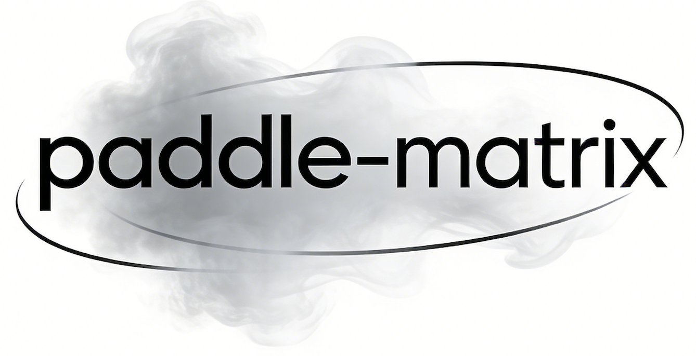
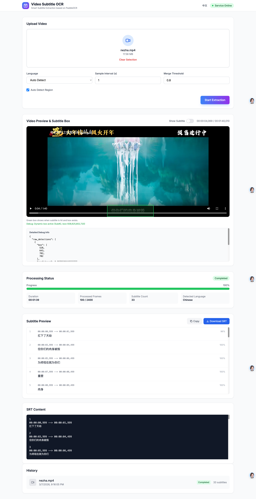

<p align="center">
  
</p>

# Paddle Matrix - 视频字幕 OCR 服务


[English](README.md)



**Paddle Matrix** 是一个基于 [PaddleOCR](https://github.com/PaddlePaddle/PaddleOCR) 的高性能 HTTP 服务，专为从视频中提取硬字幕并生成标准的 SRT 字幕文件而设计。它提供了强大的视频字幕提取 API，支持多种语言和主流视频格式。

## ✨ 功能特性

- **🎯 自动字幕检测**：智能识别视频帧中的字幕区域，无需手动指定位置。
- **🌍 多语言支持**：完美支持中文、英文、日文、韩文等多种语言。
- **📹 广泛的格式支持**：兼容 MP4、AVI、MOV、MKV、WebM、FLV、WMV 等主流视频格式。
- **📄 SRT 生成**：自动生成带有精确时间戳的标准 SubRip Subtitle (SRT) 字幕文件。
- **⚡ 同步/异步处理**：
  - **同步模式**：适用于短视频的实时处理。
  - **异步模式**：适用于长视频的后台任务处理，支持状态查询。
- **🔍 详细调试信息**：集成调试信息（原始 OCR 数据、内边距、原始框坐标）并直接在 Web UI 中展示，方便排查识别异常。
- **🐳 Docker 支持**：使用 Docker 和 Docker Compose 一键部署。
- **🖥️ Web 界面**：内置简单的 Web 界面，支持上传视频并带有交互式调试面板。

## 🧠 核心技术与算法

### 1. 智能字幕区域检测 (Subtitle Region Detection)

Paddle Matrix 采用独创的 **"Anchor Discovery Mechanism" (锚点发现机制)** 来自动定位字幕出现的区域，无需用户手动指定 ROI (Region of Interest)。

-   **多策略探测管线**:
    1.  **底部 ROI 优先**: 优先扫描视频底部 35% 区域，覆盖 90% 的字幕场景。
    2.  **全局扫描**: 若底部未发现文本，自动切换至全帧扫描模式。
    3.  **时序波段检测 (Temporal Subtitle Bands)**: 利用形态学操作 (Top-hat/Black-hat 变换) 和垂直投影分析，识别视频中具有"字幕特征"的时空波段。
-   **稳定性聚类与边距优化**:
    -   系统会对采样帧的检测结果进行 **Y 轴坐标聚类**。
    -   通过分析文本框出现的频率和位置稳定性，锁定最可能的 "Subtitle Anchor" (字幕锚点)。
    -   **动态边距增强**: 自动在计算出的中位数框基础上增加动态边距（宽度的 8%，高度的 30%），确保字幕文字边缘不会因算法误差而被截断。
    -   算法自动过滤掉偶尔出现的动态文字（如弹幕、路标），仅保留稳定的字幕流。

### 2. OCR 识别引擎 (OCR Engine)

基于百度开源的 **PaddleOCR** 深度学习框架，提供工业级的文本识别能力。

-   **模型与架构**: 使用 PP-OCRv3/v4 超轻量级模型，在保证精度的同时极大优化了推理速度。
-   **多语言动态加载**: 支持 `ch` (中英文混合), `en`, `japan`, `korean` 等多种语言模型，根据请求参数按需加载，节省显存/内存资源。
-   **预处理优化**: 内置 OpenCV 图像预处理流水线，自动进行颜色空间转换 (BGR -> RGB) 和图像增强，提升 OCR 识别率。

### 3. 字幕序列合并算法 (Subtitle Sequence Merger)

原始的逐帧 OCR 结果是碎片化的，包含大量冗余和重叠内容。我们设计了 **SubtitleMerger** 算法将其转化为流畅的 SRT 字幕。

-   **基于相似度的去重**:
    -   使用 `SequenceMatcher` 计算相邻帧文本的相似度。
    -   当相似度 > `SUBTITLE_MERGE_THRESHOLD` (默认 0.8) 且时间间隔在容差范围内时，视为同一句字幕。
-   **投票机制**: 对于同一句字幕的多个检测结果，采用 **"置信度 + 频率"** 加权投票，选出最佳文本内容，有效去除 OCR 产生的随机噪点字符。
-   **时间轴平滑与调试数据聚合**:
    -   自动合并微小的时间断裂，并根据文本长度估算合理的结束时间，生成无缝衔接的时间轴。
    -   **全链路追踪**: 为每一条合并后的字幕聚合原始检测坐标、置信度和采样帧数到 `debug_info` 对象中，提供透明的识别过程分析。

## 🛠️ 系统要求

- **Python**: 3.10 或更高版本
- **FFmpeg**: 用于视频抽帧和处理。
- **操作系统**: Linux, macOS, 或 Windows

## 🚀 快速开始

### 1. 安装

#### 安装 FFmpeg

- **Ubuntu/Debian**:
  ```bash
  sudo apt update && sudo apt install ffmpeg
  ```
- **macOS**:
  ```bash
  brew install ffmpeg
  ```
- **Windows**: 从 [FFmpeg 官网](https://ffmpeg.org/download.html) 下载并添加到 PATH 环境变量中。

#### 安装 Python 依赖

```bash
git clone https://github.com/yourusername/paddle-matrix.git
cd paddle-matrix
python -m venv .venv
source .venv/bin/activate  # Windows 用户使用: .venv\Scripts\activate
pip install -r requirements.txt
```

### 2. 启动服务

#### 使用 Uvicorn (开发模式)

```bash
uvicorn app.main:app --host 0.0.0.0 --port 8000 --reload
```

#### 使用辅助脚本

```bash
chmod +x manage.sh
./manage.sh start
```

#### 使用 Docker (生产环境推荐)

```bash
docker-compose up -d
```

服务启动后访问地址：`http://localhost:8000`。

## 📖 使用指南

### Web 界面

访问内置的 Web 界面 `http://localhost:8000/`，您可以直接在浏览器中上传视频并测试提取效果。

### API 文档

交互式 API 文档 (Swagger UI) 地址：`http://localhost:8000/docs`。

#### 主要接口

1.  **同步提取**
    -   **接口**: `POST /api/v1/subtitle/extract`
    -   **描述**: 上传视频并等待响应返回 SRT 内容。最适合短视频片段。
    -   **参数**:
        -   `video`: 视频文件 (multipart/form-data)
        -   `language`: `ch` (中文), `en` (英文), `japan` (日文), `korean` (韩文), `auto`。
        -   `sample_interval`: 采样间隔（秒），默认 1.0。

2.  **异步提取**
    -   **接口**: `POST /api/v1/subtitle/extract/async`
    -   **描述**: 上传视频并获取 `task_id`。适用于长视频。
    -   **响应**: `{"task_id": "uuid..."}`

3.  **查询任务状态**
    -   **接口**: `GET /api/v1/subtitle/status/{task_id}`
    -   **响应**: 状态 (`pending`, `processing`, `completed`, `failed`) 和进度。

4.  **下载字幕**
    -   **接口**: `GET /api/v1/subtitle/download/{task_id}`
    -   **描述**: 下载已完成任务生成的 SRT 文件。

### 示例：使用 cURL 提取字幕

```bash
# 同步提取 (中文)
curl -X POST "http://localhost:8000/api/v1/subtitle/extract" \
  -H "Content-Type: multipart/form-data" \
  -F "video=@my_video.mp4" \
  -F "language=ch" > output.srt

# 异步提取
curl -X POST "http://localhost:8000/api/v1/subtitle/extract/async" \
  -H "Content-Type: multipart/form-data" \
  -F "video=@movie.mkv"
```

## ⚙️ 配置

您可以使用环境变量或 `.env` 文件来配置应用程序。复制 `.env.example` 到 `.env` 即可开始配置。

| 变量名 | 描述 | 默认值 |
| :--- | :--- | :--- |
| `APP_NAME` | 应用名称 | Video Subtitle OCR Service |
| `DEBUG` | 开启调试模式 | `False` |
| `PADDLEOCR_LANG` | 默认 OCR 语言 | `ch` |
| `VIDEO_SAMPLE_INTERVAL` | 视频采样间隔 (秒) | `1.0` |
| `SUBTITLE_MERGE_THRESHOLD` | 文本合并相似度阈值 | `0.8` |
| `UPLOAD_DIR` | 临时上传目录 | `/tmp/uploads` |
| `OUTPUT_DIR` | SRT 生成目录 | `/tmp/outputs` |

## 🤝 贡献指南

欢迎贡献代码！请遵循以下步骤：

1.  Fork 本仓库。
2.  创建新的分支 (`git checkout -b feature/amazing-feature`)。
3.  提交更改 (`git commit -m 'feat(core): add amazing feature'`)。
4.  推送到分支 (`git push origin feature/amazing-feature`)。
5.  提交 Pull Request。

请遵守 [Conventional Commits](https://www.conventionalcommits.org/) 规范编写提交信息。

## 📄 许可证

本项目采用 Apache License 2.0 许可证 - 详情请参阅 [LICENSE](LICENSE) 文件。
